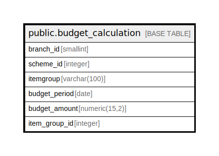

# public.budget_calculation

## Description

## Columns

| Name | Type | Default | Nullable | Children | Parents | Comment |
| ---- | ---- | ------- | -------- | -------- | ------- | ------- |
| branch_id | smallint |  | true |  |  |  |
| scheme_id | integer |  | true |  |  |  |
| itemgroup | varchar(100) | NULL::character varying | true |  |  |  |
| budget_period | date |  | true |  |  |  |
| budget_amount | numeric(15,2) | NULL::numeric | true |  |  |  |
| item_group_id | integer |  | true |  |  |  |

## Relations

---

> Generated by [tbls](https://github.com/k1LoW/tbls)
