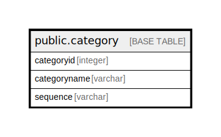

# public.category

## Description

## Columns

| Name | Type | Default | Nullable | Children | Parents | Comment |
| ---- | ---- | ------- | -------- | -------- | ------- | ------- |
| categoryid | integer | nextval('category_categoryid_seq'::regclass) | false |  |  |  |
| categoryname | varchar |  | true |  |  |  |
| sequence | varchar |  | true |  |  |  |

## Relations

---

> Generated by [tbls](https://github.com/k1LoW/tbls)
