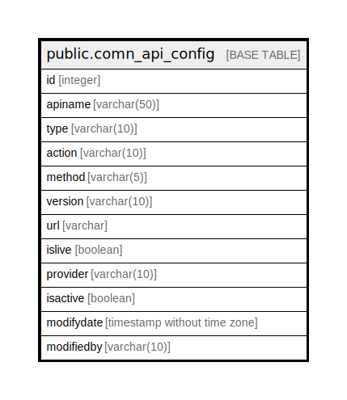

# public.comn_api_config

## Description

## Columns

| Name | Type | Default | Nullable | Children | Parents | Comment |
| ---- | ---- | ------- | -------- | -------- | ------- | ------- |
| id | integer | nextval('comn_api_config_id'::regclass) | false |  |  |  |
| apiname | varchar(50) |  | false |  |  |  |
| type | varchar(10) |  | false |  |  |  |
| action | varchar(10) |  | true |  |  |  |
| method | varchar(5) |  | false |  |  |  |
| version | varchar(10) |  | true |  |  |  |
| url | varchar |  | true |  |  |  |
| islive | boolean | false | false |  |  |  |
| provider | varchar(10) |  | false |  |  |  |
| isactive | boolean | false | false |  |  |  |
| modifydate | timestamp without time zone | now() | false |  |  |  |
| modifiedby | varchar(10) |  | true |  |  |  |

## Constraints

| Name | Type | Definition |
| ---- | ---- | ---------- |
| comn_api_config_id_key | UNIQUE | UNIQUE (id) |

## Indexes

| Name | Definition |
| ---- | ---------- |
| comn_api_config_id_key | CREATE UNIQUE INDEX comn_api_config_id_key ON public.comn_api_config USING btree (id) |

## Relations

---

> Generated by [tbls](https://github.com/k1LoW/tbls)
