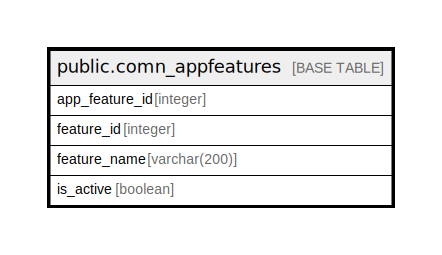

# public.comn_appfeatures

## Description

## Columns

| Name | Type | Default | Nullable | Children | Parents | Comment |
| ---- | ---- | ------- | -------- | -------- | ------- | ------- |
| app_feature_id | integer | nextval('comn_appfeatures_app_feature_id_seq'::regclass) | false |  |  |  |
| feature_id | integer |  | true |  |  |  |
| feature_name | varchar(200) |  | true |  |  |  |
| is_active | boolean |  | true |  |  |  |

## Constraints

| Name | Type | Definition |
| ---- | ---- | ---------- |
| comn_appfeatures_pkey | PRIMARY KEY | PRIMARY KEY (app_feature_id) |

## Indexes

| Name | Definition |
| ---- | ---------- |
| comn_appfeatures_pkey | CREATE UNIQUE INDEX comn_appfeatures_pkey ON public.comn_appfeatures USING btree (app_feature_id) |

## Relations

---

> Generated by [tbls](https://github.com/k1LoW/tbls)
