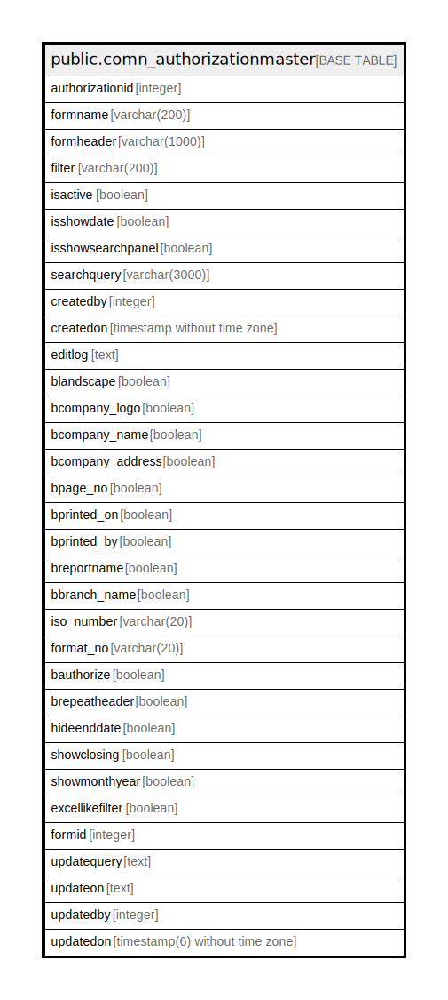

# public.comn_authorizationmaster

## Description

## Columns

| Name | Type | Default | Nullable | Children | Parents | Comment |
| ---- | ---- | ------- | -------- | -------- | ------- | ------- |
| authorizationid | integer | nextval('comn_authorizationmaster_authorizationid_seq'::regclass) | false |  |  |  |
| formname | varchar(200) |  | true |  |  |  |
| formheader | varchar(1000) |  | true |  |  |  |
| filter | varchar(200) |  | true |  |  |  |
| isactive | boolean | true | true |  |  |  |
| isshowdate | boolean | true | false |  |  |  |
| isshowsearchpanel | boolean | false | true |  |  |  |
| searchquery | varchar(3000) |  | true |  |  |  |
| createdby | integer |  | true |  |  |  |
| createdon | timestamp without time zone | now() | true |  |  |  |
| editlog | text |  | true |  |  |  |
| blandscape | boolean | false | true |  |  |  |
| bcompany_logo | boolean | false | true |  |  |  |
| bcompany_name | boolean | false | true |  |  |  |
| bcompany_address | boolean | false | true |  |  |  |
| bpage_no | boolean | false | true |  |  |  |
| bprinted_on | boolean | false | true |  |  |  |
| bprinted_by | boolean | false | true |  |  |  |
| breportname | boolean | false | true |  |  |  |
| bbranch_name | boolean | false | true |  |  |  |
| iso_number | varchar(20) |  | true |  |  |  |
| format_no | varchar(20) |  | true |  |  |  |
| bauthorize | boolean | false | true |  |  |  |
| brepeatheader | boolean | true | true |  |  |  |
| hideenddate | boolean | false | true |  |  |  |
| showclosing | boolean | false | true |  |  |  |
| showmonthyear | boolean | false | true |  |  |  |
| excellikefilter | boolean | false | true |  |  |  |
| formid | integer |  | true |  |  |  |
| updatequery | text | ''::text | false |  |  |  |
| updateon | text | ''::text | false |  |  |  |
| updatedby | integer |  | true |  |  |  |
| updatedon | timestamp(6) without time zone | NULL::timestamp without time zone | true |  |  |  |

## Constraints

| Name | Type | Definition |
| ---- | ---- | ---------- |
| comn_authorizationmaster_pkey | PRIMARY KEY | PRIMARY KEY (authorizationid) |

## Indexes

| Name | Definition |
| ---- | ---------- |
| comn_authorizationmaster_pkey | CREATE UNIQUE INDEX comn_authorizationmaster_pkey ON public.comn_authorizationmaster USING btree (authorizationid) |

## Relations

---

> Generated by [tbls](https://github.com/k1LoW/tbls)
