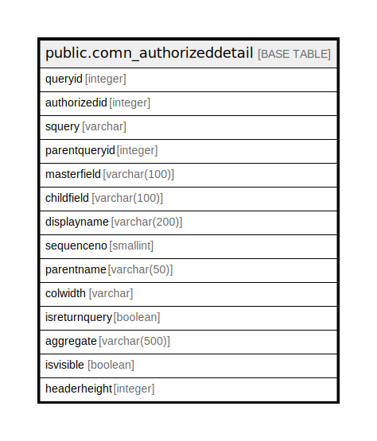

# public.comn_authorizeddetail

## Description

## Columns

| Name | Type | Default | Nullable | Children | Parents | Comment |
| ---- | ---- | ------- | -------- | -------- | ------- | ------- |
| queryid | integer |  | false |  |  |  |
| authorizedid | integer |  | true |  |  |  |
| squery | varchar |  | true |  |  |  |
| parentqueryid | integer |  | true |  |  |  |
| masterfield | varchar(100) |  | true |  |  |  |
| childfield | varchar(100) |  | true |  |  |  |
| displayname | varchar(200) |  | true |  |  |  |
| sequenceno | smallint | 1 | true |  |  |  |
| parentname | varchar(50) |  | true |  |  |  |
| colwidth | varchar |  | true |  |  |  |
| isreturnquery | boolean | false | false |  |  |  |
| aggregate | varchar(500) | NULL::character varying | true |  |  |  |
| isvisible | boolean | true | true |  |  |  |
| headerheight | integer | 30 | true |  |  |  |

## Constraints

| Name | Type | Definition |
| ---- | ---- | ---------- |
| comn_authorizeddetail_pkey | PRIMARY KEY | PRIMARY KEY (queryid) |

## Indexes

| Name | Definition |
| ---- | ---------- |
| comn_authorizeddetail_pkey | CREATE UNIQUE INDEX comn_authorizeddetail_pkey ON public.comn_authorizeddetail USING btree (queryid) |

## Relations

---

> Generated by [tbls](https://github.com/k1LoW/tbls)
