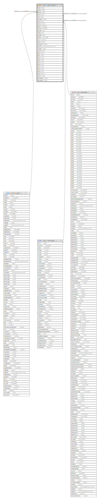

# public.comn_batchmaster

## Description

New batch will create in this table.

## Columns

| Name | Type | Default | Nullable | Children | Parents | Comment |
| ---- | ---- | ------- | -------- | -------- | ------- | ------- |
| batchid | integer | nextval('seq_batchid'::regclass) | false |  |  |  |
| cuttoffid | integer | 0 | false |  |  |  |
| branchid | integer |  | false |  | [public.branchmaster](public.branchmaster.md) |  |
| formid | integer |  | false |  | [public.comn_formmaster](public.comn_formmaster.md) | From which form batch created. |
| docid | integer |  | false |  |  | Summary table Id of batch created transaction. |
| docdetailid | integer |  | false |  |  | Item Detail table Id of batch created transaction. |
| itemid | integer |  | false |  | [public.stor_itemmaster](public.stor_itemmaster.md) |  |
| seriesno | integer |  | false |  |  |  |
| batchno | varchar(50) |  | false |  |  |  |
| userlotno | varchar(50) |  | false |  |  |  |
| batchdate | date |  | false |  |  |  |
| mfgdate | date |  | false |  |  |  |
| expirydate | date |  | false |  |  |  |
| costprice | numeric(18,5) | 0 | true |  |  | Batch inward cost. |
| mrp | numeric(18,5) | 0 | true |  |  |  |
| isactive | boolean | true | true |  |  |  |
| isauthorized | boolean | false | true |  |  |  |
| createdon | timestamp without time zone | now() | false |  |  |  |
| createdby | integer |  | false |  |  |  |
| seriesid | integer | 0 | false |  |  | based on series will be applied and its optinal |
| field1 | varchar |  | true |  |  |  |
| field2 | varchar |  | true |  |  |  |
| field3 | varchar |  | true |  |  |  |
| field4 | varchar |  | true |  |  |  |
| field5 | varchar |  | true |  |  |  |
| field6 | varchar |  | true |  |  |  |
| field7 | varchar |  | true |  |  |  |
| field8 | varchar |  | true |  |  |  |
| field9 | varchar |  | true |  |  |  |
| field10 | varchar |  | true |  |  |  |
| refdocid | integer |  | true |  |  |  |
| parentbatchid | integer | 0 | true |  |  |  |

## Constraints

| Name | Type | Definition |
| ---- | ---- | ---------- |
| comn_batchmaster_branchid_fkey | FOREIGN KEY | FOREIGN KEY (branchid) REFERENCES branchmaster(branchid) |
| comn_batchmaster_batchid_key | UNIQUE | UNIQUE (batchid) |
| comn_batchmaster_pkey | PRIMARY KEY | PRIMARY KEY (branchid, formid, docid, docdetailid, itemid, batchno) |
| comn_batchmaster_formid_fkey | FOREIGN KEY | FOREIGN KEY (formid) REFERENCES comn_formmaster(formid) |
| comn_batchmaster_itemid_fkey | FOREIGN KEY | FOREIGN KEY (itemid) REFERENCES stor_itemmaster(itemid) |

## Indexes

| Name | Definition |
| ---- | ---------- |
| comn_batchmaster_batchid_key | CREATE UNIQUE INDEX comn_batchmaster_batchid_key ON public.comn_batchmaster USING btree (batchid) |
| comn_batchmaster_pkey | CREATE UNIQUE INDEX comn_batchmaster_pkey ON public.comn_batchmaster USING btree (branchid, formid, docid, docdetailid, itemid, batchno) |

## Relations

---

> Generated by [tbls](https://github.com/k1LoW/tbls)
