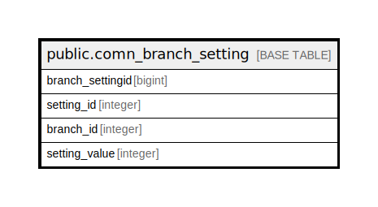

# public.comn_branch_setting

## Description

## Columns

| Name | Type | Default | Nullable | Children | Parents | Comment |
| ---- | ---- | ------- | -------- | -------- | ------- | ------- |
| branch_settingid | bigint | nextval('comn_branch_setting_branch_settingid_seq'::regclass) | false |  |  |  |
| setting_id | integer |  | false |  |  |  |
| branch_id | integer |  | false |  |  |  |
| setting_value | integer |  | false |  |  |  |

## Constraints

| Name | Type | Definition |
| ---- | ---- | ---------- |
| comn_branch_setting_pkey | PRIMARY KEY | PRIMARY KEY (branch_settingid) |

## Indexes

| Name | Definition |
| ---- | ---------- |
| comn_branch_setting_pkey | CREATE UNIQUE INDEX comn_branch_setting_pkey ON public.comn_branch_setting USING btree (branch_settingid) |

## Relations

---

> Generated by [tbls](https://github.com/k1LoW/tbls)
