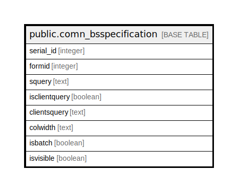

# public.comn_bsspecification

## Description

## Columns

| Name | Type | Default | Nullable | Children | Parents | Comment |
| ---- | ---- | ------- | -------- | -------- | ------- | ------- |
| serial_id | integer | nextval('comn_bsspecification_serial_id_seq'::regclass) | false |  |  |  |
| formid | integer |  | true |  |  |  |
| squery | text |  | true |  |  |  |
| isclientquery | boolean | false | true |  |  |  |
| clientsquery | text |  | true |  |  |  |
| colwidth | text |  | true |  |  |  |
| isbatch | boolean | true | true |  |  |  |
| isvisible | boolean | false | true |  |  |  |

## Constraints

| Name | Type | Definition |
| ---- | ---- | ---------- |
| comn_bsspecification_pkey | PRIMARY KEY | PRIMARY KEY (serial_id) |
| comn_bsspecification_specification_key | UNIQUE | UNIQUE (formid) |

## Indexes

| Name | Definition |
| ---- | ---------- |
| comn_bsspecification_pkey | CREATE UNIQUE INDEX comn_bsspecification_pkey ON public.comn_bsspecification USING btree (serial_id) |
| comn_bsspecification_specification_key | CREATE UNIQUE INDEX comn_bsspecification_specification_key ON public.comn_bsspecification USING btree (formid) |

## Relations

---

> Generated by [tbls](https://github.com/k1LoW/tbls)
