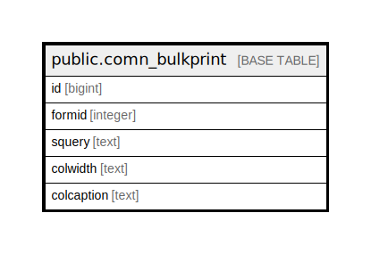

# public.comn_bulkprint

## Description

## Columns

| Name | Type | Default | Nullable | Children | Parents | Comment |
| ---- | ---- | ------- | -------- | -------- | ------- | ------- |
| id | bigint | nextval('comn_bulkprint_id_seq'::regclass) | false |  |  |  |
| formid | integer |  | false |  |  |  |
| squery | text |  | false |  |  | {First Col:Boolean,Second :ID, Third : Number, Forth Date } |
| colwidth | text |  | true |  |  |  |
| colcaption | text |  | true |  |  |  |

## Constraints

| Name | Type | Definition |
| ---- | ---- | ---------- |
| comn_bulkprint_pkey | PRIMARY KEY | PRIMARY KEY (id) |

## Indexes

| Name | Definition |
| ---- | ---------- |
| comn_bulkprint_pkey | CREATE UNIQUE INDEX comn_bulkprint_pkey ON public.comn_bulkprint USING btree (id) |

## Relations

---

> Generated by [tbls](https://github.com/k1LoW/tbls)
