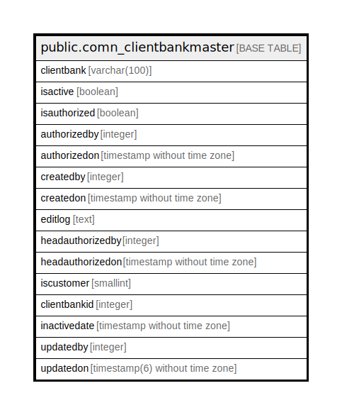

# public.comn_clientbankmaster

## Description

## Columns

| Name | Type | Default | Nullable | Children | Parents | Comment |
| ---- | ---- | ------- | -------- | -------- | ------- | ------- |
| clientbank | varchar(100) | NULL::character varying | true |  |  |  |
| isactive | boolean | true | true |  |  |  |
| isauthorized | boolean | false | false |  |  |  |
| authorizedby | integer |  | true |  |  |  |
| authorizedon | timestamp without time zone |  | true |  |  |  |
| createdby | integer |  | true |  |  |  |
| createdon | timestamp without time zone | now() | true |  |  |  |
| editlog | text |  | true |  |  |  |
| headauthorizedby | integer |  | true |  |  |  |
| headauthorizedon | timestamp without time zone |  | true |  |  |  |
| iscustomer | smallint | 1 | true |  |  | 1=Party 2=Customer |
| clientbankid | integer | nextval('comn_clientbankmaster_clientbankid_seq'::regclass) | false |  |  |  |
| inactivedate | timestamp without time zone |  | true |  |  |  |
| updatedby | integer |  | true |  |  |  |
| updatedon | timestamp(6) without time zone | NULL::timestamp without time zone | true |  |  |  |

## Constraints

| Name | Type | Definition |
| ---- | ---- | ---------- |
| prod_reasonmaster_copy_pkey | PRIMARY KEY | PRIMARY KEY (clientbankid) |

## Indexes

| Name | Definition |
| ---- | ---------- |
| prod_reasonmaster_copy_pkey | CREATE UNIQUE INDEX prod_reasonmaster_copy_pkey ON public.comn_clientbankmaster USING btree (clientbankid) |

## Relations

---

> Generated by [tbls](https://github.com/k1LoW/tbls)
