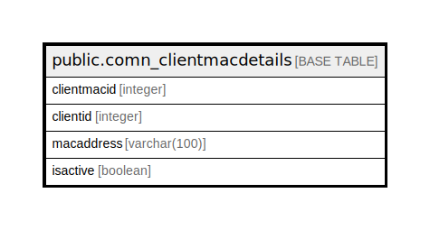

# public.comn_clientmacdetails

## Description

## Columns

| Name | Type | Default | Nullable | Children | Parents | Comment |
| ---- | ---- | ------- | -------- | -------- | ------- | ------- |
| clientmacid | integer |  | false |  |  |  |
| clientid | integer |  | false |  |  |  |
| macaddress | varchar(100) |  | true |  |  |  |
| isactive | boolean |  | true |  |  |  |

## Constraints

| Name | Type | Definition |
| ---- | ---- | ---------- |
| comn_clientmacdetails_pkey | PRIMARY KEY | PRIMARY KEY (clientmacid) |

## Indexes

| Name | Definition |
| ---- | ---------- |
| comn_clientmacdetails_pkey | CREATE UNIQUE INDEX comn_clientmacdetails_pkey ON public.comn_clientmacdetails USING btree (clientmacid) |

## Relations

---

> Generated by [tbls](https://github.com/k1LoW/tbls)
