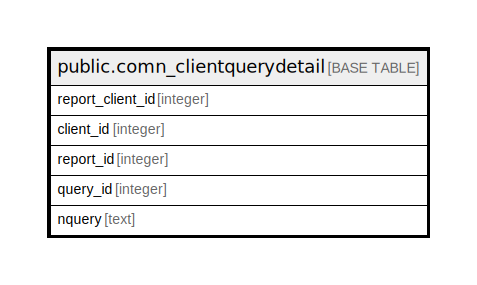

# public.comn_clientquerydetail

## Description

## Columns

| Name | Type | Default | Nullable | Children | Parents | Comment |
| ---- | ---- | ------- | -------- | -------- | ------- | ------- |
| report_client_id | integer | nextval('comn_clientquerydetail_report_client_id_seq'::regclass) | false |  |  |  |
| client_id | integer |  | true |  |  |  |
| report_id | integer |  | true |  |  |  |
| query_id | integer |  | true |  |  |  |
| nquery | text |  | true |  |  |  |

## Constraints

| Name | Type | Definition |
| ---- | ---- | ---------- |
| comn_clientquerydetail_pkey | PRIMARY KEY | PRIMARY KEY (report_client_id) |
| uniqueclientquery | UNIQUE | UNIQUE (client_id, query_id) |

## Indexes

| Name | Definition |
| ---- | ---------- |
| comn_clientquerydetail_pkey | CREATE UNIQUE INDEX comn_clientquerydetail_pkey ON public.comn_clientquerydetail USING btree (report_client_id) |
| uniqueclientquery | CREATE UNIQUE INDEX uniqueclientquery ON public.comn_clientquerydetail USING btree (client_id, query_id) |

## Relations

---

> Generated by [tbls](https://github.com/k1LoW/tbls)
