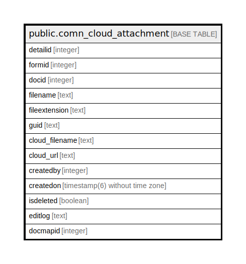

# public.comn_cloud_attachment

## Description

## Columns

| Name | Type | Default | Nullable | Children | Parents | Comment |
| ---- | ---- | ------- | -------- | -------- | ------- | ------- |
| detailid | integer | nextval('comn_cloud_attachment_detailid_seq'::regclass) | false |  |  |  |
| formid | integer |  | true |  |  |  |
| docid | integer |  | true |  |  |  |
| filename | text |  | true |  |  |  |
| fileextension | text |  | true |  |  |  |
| guid | text |  | true |  |  |  |
| cloud_filename | text |  | true |  |  |  |
| cloud_url | text |  | true |  |  |  |
| createdby | integer |  | true |  |  |  |
| createdon | timestamp(6) without time zone | now() | true |  |  |  |
| isdeleted | boolean | false | true |  |  |  |
| editlog | text |  | true |  |  |  |
| docmapid | integer |  | true |  |  |  |

## Constraints

| Name | Type | Definition |
| ---- | ---- | ---------- |
| comn_cloud_attachment_pkey | PRIMARY KEY | PRIMARY KEY (detailid) |

## Indexes

| Name | Definition |
| ---- | ---------- |
| comn_cloud_attachment_pkey | CREATE UNIQUE INDEX comn_cloud_attachment_pkey ON public.comn_cloud_attachment USING btree (detailid) |

## Relations

---

> Generated by [tbls](https://github.com/k1LoW/tbls)
