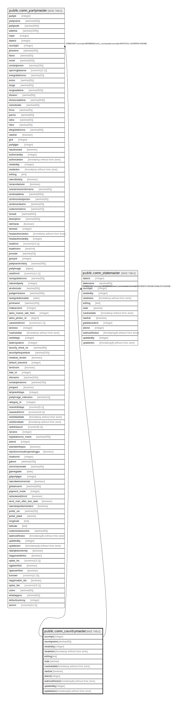

# public.comn_countrymaster

## Description

## Columns

| Name | Type | Default | Nullable | Children | Parents | Comment |
| ---- | ---- | ------- | -------- | -------- | ------- | ------- |
| countryid | integer | nextval('comn_countrymaster_countryid_seq'::regclass) | false | [public.comn_partymaster](public.comn_partymaster.md) [public.comn_statemaster](public.comn_statemaster.md) |  |  |
| countryname | varchar(30) |  | false |  |  |  |
| createdby | integer |  | true |  |  |  |
| createdon | timestamp without time zone | now() | true |  |  |  |
| editlog | text |  | true |  |  |  |
| code | varchar |  | true |  |  |  |
| inactivedate | timestamp without time zone |  | true |  |  |  |
| isactive | boolean |  | true |  |  |  |
| alterid | integer |  | true |  |  |  |
| lastmodifiedon | timestamp(6) without time zone | now() | true |  |  |  |
| updatedby | integer |  | true |  |  |  |
| updatedon | timestamp(6) without time zone | NULL::timestamp without time zone | true |  |  |  |

## Constraints

| Name | Type | Definition |
| ---- | ---- | ---------- |
| countrymaster_code | UNIQUE | UNIQUE (code) |
| countrymaster_countryname_key | UNIQUE | UNIQUE (countryname) |
| countrymaster_pkey | PRIMARY KEY | PRIMARY KEY (countryid) |

## Indexes

| Name | Definition |
| ---- | ---------- |
| countrymaster_code | CREATE UNIQUE INDEX countrymaster_code ON public.comn_countrymaster USING btree (code) |
| countrymaster_countryname_key | CREATE UNIQUE INDEX countrymaster_countryname_key ON public.comn_countrymaster USING btree (countryname) |
| countrymaster_pkey | CREATE UNIQUE INDEX countrymaster_pkey ON public.comn_countrymaster USING btree (countryid) |

## Triggers

| Name | Definition |
| ---- | ---------- |
| mob_updatealterid | CREATE TRIGGER mob_updatealterid AFTER INSERT OR UPDATE ON public.comn_countrymaster FOR EACH ROW EXECUTE FUNCTION mob_updatealterid() |

## Relations

---

> Generated by [tbls](https://github.com/k1LoW/tbls)
