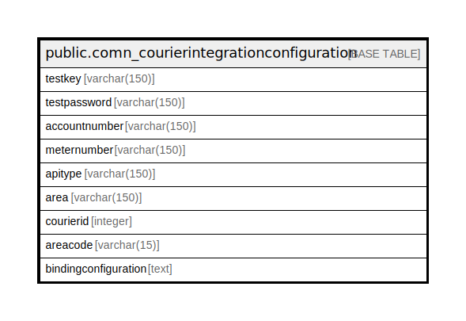

# public.comn_courierintegrationconfiguration

## Description

## Columns

| Name | Type | Default | Nullable | Children | Parents | Comment |
| ---- | ---- | ------- | -------- | -------- | ------- | ------- |
| testkey | varchar(150) |  | true |  |  | testkey for fedx  accoutcode for bluedart |
| testpassword | varchar(150) |  | true |  |  | testpassword for fedx lisencekey for bluedart |
| accountnumber | varchar(150) |  | true |  |  | accountnumber for fedx loginid for bluedart |
| meternumber | varchar(150) |  | true |  |  | meternumber for fedx version for bluedart |
| apitype | varchar(150) |  | true |  |  | for bluedart only |
| area | varchar(150) |  | true |  |  | for bluedart only |
| courierid | integer |  | true |  |  |  |
| areacode | varchar(15) | ''::character varying | false |  |  |  |
| bindingconfiguration | text |  | true |  |  |  |

## Relations

---

> Generated by [tbls](https://github.com/k1LoW/tbls)
