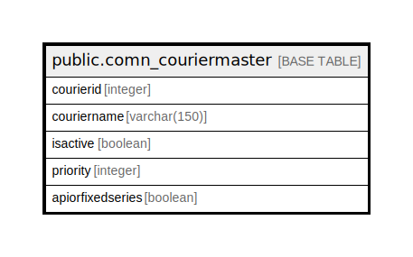

# public.comn_couriermaster

## Description

## Columns

| Name | Type | Default | Nullable | Children | Parents | Comment |
| ---- | ---- | ------- | -------- | -------- | ------- | ------- |
| courierid | integer | nextval('comn_couriermaster_courierid_seq'::regclass) | false |  |  |  |
| couriername | varchar(150) |  | true |  |  |  |
| isactive | boolean |  | true |  |  |  |
| priority | integer |  | true |  |  |  |
| apiorfixedseries | boolean |  | true |  |  | True For API False For Fixed Series |

## Constraints

| Name | Type | Definition |
| ---- | ---- | ---------- |
| comn_couriermaster_pkey | PRIMARY KEY | PRIMARY KEY (courierid) |

## Indexes

| Name | Definition |
| ---- | ---------- |
| comn_couriermaster_pkey | CREATE UNIQUE INDEX comn_couriermaster_pkey ON public.comn_couriermaster USING btree (courierid) |

## Relations

---

> Generated by [tbls](https://github.com/k1LoW/tbls)
