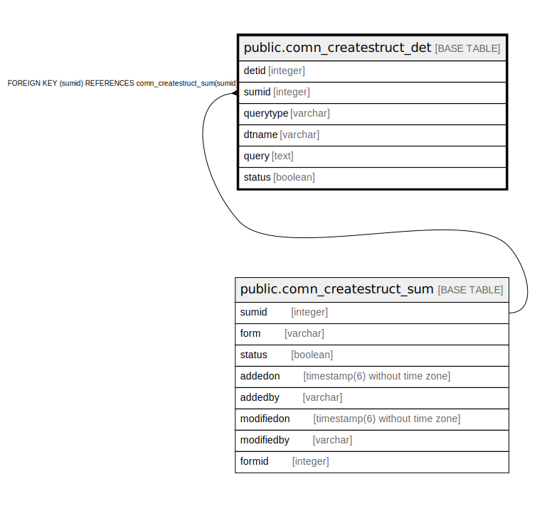

# public.comn_createstruct_det

## Description

## Columns

| Name | Type | Default | Nullable | Children | Parents | Comment |
| ---- | ---- | ------- | -------- | -------- | ------- | ------- |
| detid | integer | nextval('comn_createstruct_det_id'::regclass) | false |  |  |  |
| sumid | integer |  | false |  | [public.comn_createstruct_sum](public.comn_createstruct_sum.md) |  |
| querytype | varchar |  | false |  |  |  |
| dtname | varchar |  | false |  |  |  |
| query | text |  | false |  |  |  |
| status | boolean | true | false |  |  |  |

## Constraints

| Name | Type | Definition |
| ---- | ---- | ---------- |
| comn_createstruct_det_detid_key | UNIQUE | UNIQUE (detid) |
| comn_createstruct_det_pkey | PRIMARY KEY | PRIMARY KEY (sumid, querytype, dtname) |
| comn_createstruct_det_sumid_fkey | FOREIGN KEY | FOREIGN KEY (sumid) REFERENCES comn_createstruct_sum(sumid) |

## Indexes

| Name | Definition |
| ---- | ---------- |
| comn_createstruct_det_detid_key | CREATE UNIQUE INDEX comn_createstruct_det_detid_key ON public.comn_createstruct_det USING btree (detid) |
| comn_createstruct_det_pkey | CREATE UNIQUE INDEX comn_createstruct_det_pkey ON public.comn_createstruct_det USING btree (sumid, querytype, dtname) |

## Relations

---

> Generated by [tbls](https://github.com/k1LoW/tbls)
