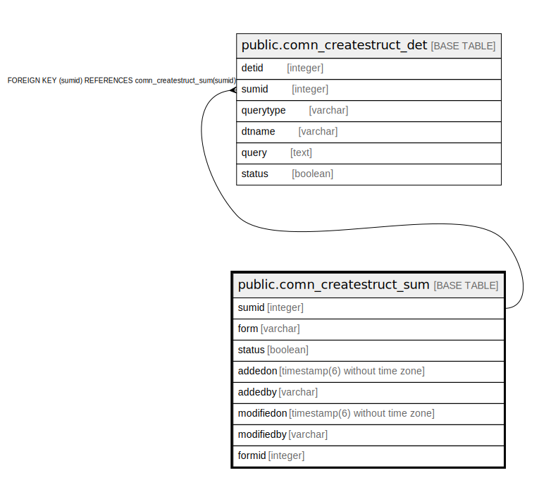

# public.comn_createstruct_sum

## Description

## Columns

| Name | Type | Default | Nullable | Children | Parents | Comment |
| ---- | ---- | ------- | -------- | -------- | ------- | ------- |
| sumid | integer | nextval('comn_createstruct_sum_id'::regclass) | false | [public.comn_createstruct_det](public.comn_createstruct_det.md) |  |  |
| form | varchar |  | false |  |  |  |
| status | boolean | true | false |  |  |  |
| addedon | timestamp(6) without time zone | now() | false |  |  |  |
| addedby | varchar |  | false |  |  |  |
| modifiedon | timestamp(6) without time zone |  | true |  |  |  |
| modifiedby | varchar |  | true |  |  |  |
| formid | integer |  | true |  |  |  |

## Constraints

| Name | Type | Definition |
| ---- | ---- | ---------- |
| comn_createstruct_sum_pkey | PRIMARY KEY | PRIMARY KEY (form) |
| comn_createstruct_sum_sumid_key | UNIQUE | UNIQUE (sumid) |

## Indexes

| Name | Definition |
| ---- | ---------- |
| comn_createstruct_sum_pkey | CREATE UNIQUE INDEX comn_createstruct_sum_pkey ON public.comn_createstruct_sum USING btree (form) |
| comn_createstruct_sum_sumid_key | CREATE UNIQUE INDEX comn_createstruct_sum_sumid_key ON public.comn_createstruct_sum USING btree (sumid) |

## Relations

---

> Generated by [tbls](https://github.com/k1LoW/tbls)
