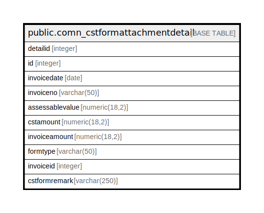

# public.comn_cstformattachmentdetail

## Description

## Columns

| Name | Type | Default | Nullable | Children | Parents | Comment |
| ---- | ---- | ------- | -------- | -------- | ------- | ------- |
| detailid | integer | nextval('comn_cstformattachmentdetail_detailid_seq'::regclass) | false |  |  |  |
| id | integer |  | true |  |  |  |
| invoicedate | date |  | true |  |  |  |
| invoiceno | varchar(50) |  | true |  |  |  |
| assessablevalue | numeric(18,2) |  | true |  |  |  |
| cstamount | numeric(18,2) |  | true |  |  |  |
| invoiceamount | numeric(18,2) |  | true |  |  |  |
| formtype | varchar(50) |  | true |  |  |  |
| invoiceid | integer |  | true |  |  |  |
| cstformremark | varchar(250) |  | true |  |  |  |

## Constraints

| Name | Type | Definition |
| ---- | ---- | ---------- |
| comn_cstformattachmentdetail_pkey | PRIMARY KEY | PRIMARY KEY (detailid) |

## Indexes

| Name | Definition |
| ---- | ---------- |
| comn_cstformattachmentdetail_pkey | CREATE UNIQUE INDEX comn_cstformattachmentdetail_pkey ON public.comn_cstformattachmentdetail USING btree (detailid) |

## Relations

---

> Generated by [tbls](https://github.com/k1LoW/tbls)
