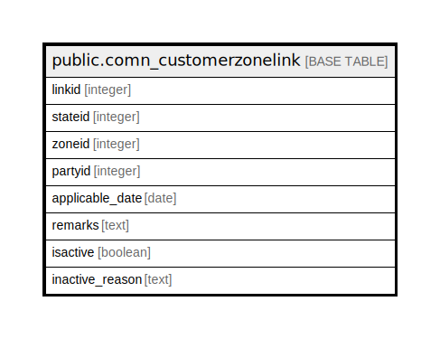

# public.comn_customerzonelink

## Description

## Columns

| Name | Type | Default | Nullable | Children | Parents | Comment |
| ---- | ---- | ------- | -------- | -------- | ------- | ------- |
| linkid | integer | nextval('comn_customerzonelink_linkid_seq'::regclass) | false |  |  |  |
| stateid | integer |  | true |  |  |  |
| zoneid | integer |  | true |  |  |  |
| partyid | integer |  | true |  |  |  |
| applicable_date | date |  | true |  |  |  |
| remarks | text |  | true |  |  |  |
| isactive | boolean | false | true |  |  |  |
| inactive_reason | text |  | true |  |  |  |

## Constraints

| Name | Type | Definition |
| ---- | ---- | ---------- |
| pk_linkid | PRIMARY KEY | PRIMARY KEY (linkid) |

## Indexes

| Name | Definition |
| ---- | ---------- |
| pk_linkid | CREATE UNIQUE INDEX pk_linkid ON public.comn_customerzonelink USING btree (linkid) |

## Relations

---

> Generated by [tbls](https://github.com/k1LoW/tbls)
