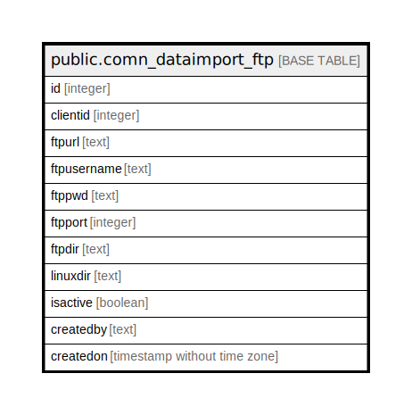

# public.comn_dataimport_ftp

## Description

## Columns

| Name | Type | Default | Nullable | Children | Parents | Comment |
| ---- | ---- | ------- | -------- | -------- | ------- | ------- |
| id | integer |  | false |  |  |  |
| clientid | integer |  | false |  |  |  |
| ftpurl | text |  | false |  |  |  |
| ftpusername | text |  | false |  |  |  |
| ftppwd | text |  | false |  |  |  |
| ftpport | integer |  | false |  |  |  |
| ftpdir | text |  | true |  |  |  |
| linuxdir | text |  | true |  |  |  |
| isactive | boolean | true | false |  |  |  |
| createdby | text |  | true |  |  |  |
| createdon | timestamp without time zone | now() | true |  |  |  |

## Constraints

| Name | Type | Definition |
| ---- | ---- | ---------- |
| comn_dataimport_ftp_clientid_isactive_key | UNIQUE | UNIQUE (clientid, isactive) |

## Indexes

| Name | Definition |
| ---- | ---------- |
| comn_dataimport_ftp_clientid_isactive_key | CREATE UNIQUE INDEX comn_dataimport_ftp_clientid_isactive_key ON public.comn_dataimport_ftp USING btree (clientid, isactive) |

## Relations

---

> Generated by [tbls](https://github.com/k1LoW/tbls)
