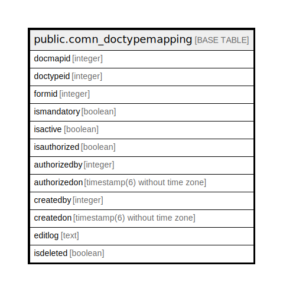

# public.comn_doctypemapping

## Description

## Columns

| Name | Type | Default | Nullable | Children | Parents | Comment |
| ---- | ---- | ------- | -------- | -------- | ------- | ------- |
| docmapid | integer | nextval('comn_doctypemapping_docmapid_seq'::regclass) | false |  |  |  |
| doctypeid | integer |  | true |  |  |  |
| formid | integer |  | true |  |  |  |
| ismandatory | boolean |  | true |  |  |  |
| isactive | boolean |  | true |  |  |  |
| isauthorized | boolean |  | true |  |  |  |
| authorizedby | integer |  | true |  |  |  |
| authorizedon | timestamp(6) without time zone |  | true |  |  |  |
| createdby | integer |  | true |  |  |  |
| createdon | timestamp(6) without time zone | now() | true |  |  |  |
| editlog | text |  | true |  |  |  |
| isdeleted | boolean | false | true |  |  |  |

## Constraints

| Name | Type | Definition |
| ---- | ---- | ---------- |
| comn_doctypemapping_pkey | PRIMARY KEY | PRIMARY KEY (docmapid) |

## Indexes

| Name | Definition |
| ---- | ---------- |
| comn_doctypemapping_pkey | CREATE UNIQUE INDEX comn_doctypemapping_pkey ON public.comn_doctypemapping USING btree (docmapid) |

## Relations

---

> Generated by [tbls](https://github.com/k1LoW/tbls)
