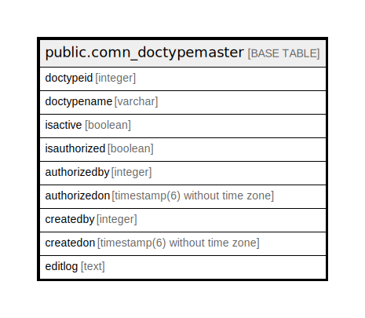

# public.comn_doctypemaster

## Description

## Columns

| Name | Type | Default | Nullable | Children | Parents | Comment |
| ---- | ---- | ------- | -------- | -------- | ------- | ------- |
| doctypeid | integer | nextval('comn_doctypemaster_doctypeid_seq'::regclass) | false |  |  |  |
| doctypename | varchar |  | true |  |  |  |
| isactive | boolean |  | true |  |  |  |
| isauthorized | boolean |  | true |  |  |  |
| authorizedby | integer |  | true |  |  |  |
| authorizedon | timestamp(6) without time zone |  | true |  |  |  |
| createdby | integer |  | true |  |  |  |
| createdon | timestamp(6) without time zone | now() | true |  |  |  |
| editlog | text |  | true |  |  |  |

## Constraints

| Name | Type | Definition |
| ---- | ---- | ---------- |
| comn_doctypemaster_pkey | PRIMARY KEY | PRIMARY KEY (doctypeid) |
| doctypename | UNIQUE | UNIQUE (doctypename) |

## Indexes

| Name | Definition |
| ---- | ---------- |
| comn_doctypemaster_pkey | CREATE UNIQUE INDEX comn_doctypemaster_pkey ON public.comn_doctypemaster USING btree (doctypeid) |
| doctypename | CREATE UNIQUE INDEX doctypename ON public.comn_doctypemaster USING btree (doctypename) |

## Relations

---

> Generated by [tbls](https://github.com/k1LoW/tbls)
