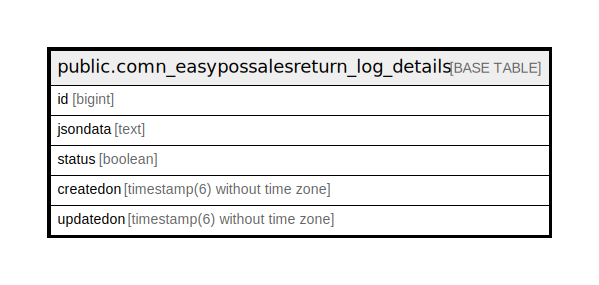

# public.comn_easypossalesreturn_log_details

## Description

## Columns

| Name | Type | Default | Nullable | Children | Parents | Comment |
| ---- | ---- | ------- | -------- | -------- | ------- | ------- |
| id | bigint | nextval('comn_easypossalesreturn_log_details_id_seq'::regclass) | false |  |  |  |
| jsondata | text |  | true |  |  |  |
| status | boolean | false | true |  |  |  |
| createdon | timestamp(6) without time zone | now() | true |  |  |  |
| updatedon | timestamp(6) without time zone |  | true |  |  |  |

## Constraints

| Name | Type | Definition |
| ---- | ---- | ---------- |
| comn_easypossalesreturn_log_details_pkey | PRIMARY KEY | PRIMARY KEY (id) |

## Indexes

| Name | Definition |
| ---- | ---------- |
| comn_easypossalesreturn_log_details_pkey | CREATE UNIQUE INDEX comn_easypossalesreturn_log_details_pkey ON public.comn_easypossalesreturn_log_details USING btree (id) |

## Relations

---

> Generated by [tbls](https://github.com/k1LoW/tbls)
