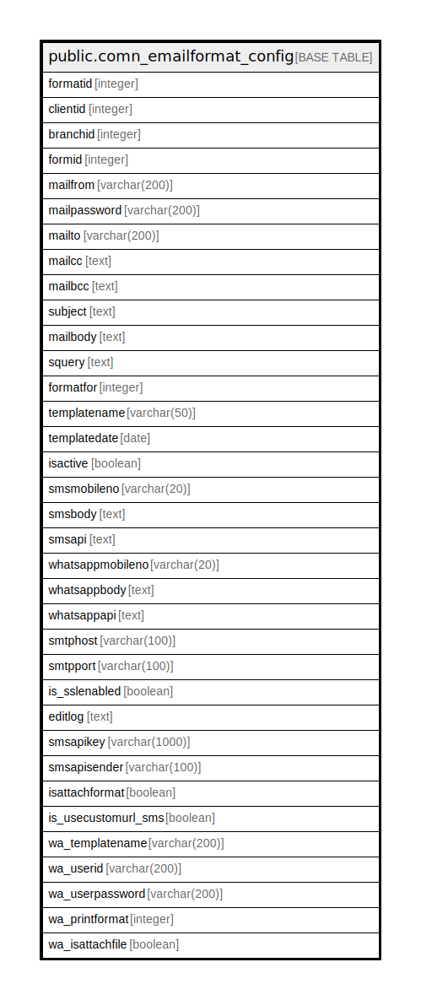

# public.comn_emailformat_config

## Description

## Columns

| Name | Type | Default | Nullable | Children | Parents | Comment |
| ---- | ---- | ------- | -------- | -------- | ------- | ------- |
| formatid | integer | nextval('comn_emailformat_config_formatid_seq'::regclass) | false |  |  |  |
| clientid | integer | 0 | true |  |  |  |
| branchid | integer | 0 | true |  |  |  |
| formid | integer | 0 | true |  |  |  |
| mailfrom | varchar(200) | NULL::character varying | true |  |  |  |
| mailpassword | varchar(200) | NULL::character varying | true |  |  |  |
| mailto | varchar(200) | NULL::character varying | true |  |  |  |
| mailcc | text |  | true |  |  |  |
| mailbcc | text |  | true |  |  |  |
| subject | text |  | true |  |  |  |
| mailbody | text |  | true |  |  |  |
| squery | text |  | true |  |  |  |
| formatfor | integer | 1 | true |  |  |  |
| templatename | varchar(50) | NULL::character varying | true |  |  |  |
| templatedate | date |  | true |  |  |  |
| isactive | boolean | false | true |  |  |  |
| smsmobileno | varchar(20) | NULL::character varying | true |  |  |  |
| smsbody | text |  | true |  |  |  |
| smsapi | text |  | true |  |  |  |
| whatsappmobileno | varchar(20) | NULL::character varying | true |  |  |  |
| whatsappbody | text |  | true |  |  |  |
| whatsappapi | text |  | true |  |  |  |
| smtphost | varchar(100) | NULL::character varying | true |  |  |  |
| smtpport | varchar(100) | NULL::character varying | true |  |  |  |
| is_sslenabled | boolean | false | true |  |  |  |
| editlog | text |  | true |  |  |  |
| smsapikey | varchar(1000) | NULL::character varying | true |  |  |  |
| smsapisender | varchar(100) | NULL::character varying | true |  |  |  |
| isattachformat | boolean | false | true |  |  |  |
| is_usecustomurl_sms | boolean | false | true |  |  |  |
| wa_templatename | varchar(200) |  | true |  |  |  |
| wa_userid | varchar(200) |  | true |  |  |  |
| wa_userpassword | varchar(200) |  | true |  |  |  |
| wa_printformat | integer | 0 | true |  |  |  |
| wa_isattachfile | boolean | false | true |  |  |  |

## Constraints

| Name | Type | Definition |
| ---- | ---- | ---------- |
| comn_emailformat_config_pkey | PRIMARY KEY | PRIMARY KEY (formatid) |

## Indexes

| Name | Definition |
| ---- | ---------- |
| comn_emailformat_config_pkey | CREATE UNIQUE INDEX comn_emailformat_config_pkey ON public.comn_emailformat_config USING btree (formatid) |

## Relations

---

> Generated by [tbls](https://github.com/k1LoW/tbls)
