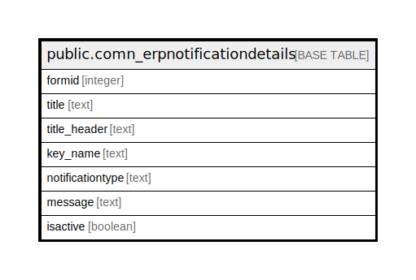

# public.comn_erpnotificationdetails

## Description

## Columns

| Name | Type | Default | Nullable | Children | Parents | Comment |
| ---- | ---- | ------- | -------- | -------- | ------- | ------- |
| formid | integer |  | true |  |  |  |
| title | text |  | true |  |  |  |
| title_header | text |  | true |  |  |  |
| key_name | text |  | true |  |  |  |
| notificationtype | text |  | true |  |  |  |
| message | text |  | true |  |  |  |
| isactive | boolean | false | true |  |  |  |

## Relations

---

> Generated by [tbls](https://github.com/k1LoW/tbls)
