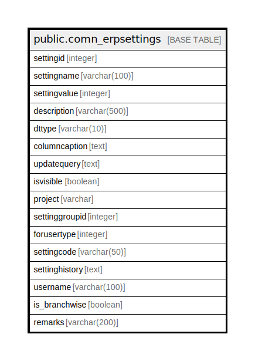

# public.comn_erpsettings

## Description

## Columns

| Name | Type | Default | Nullable | Children | Parents | Comment |
| ---- | ---- | ------- | -------- | -------- | ------- | ------- |
| settingid | integer |  | false |  |  |  |
| settingname | varchar(100) |  | true |  |  |  |
| settingvalue | integer |  | true |  |  |  |
| description | varchar(500) |  | true |  |  |  |
| dttype | varchar(10) |  | true |  |  |  |
| columncaption | text |  | true |  |  |  |
| updatequery | text | NULL::character varying | true |  |  |  |
| isvisible | boolean | false | false |  |  |  |
| project | varchar | 'ERP'::character varying | false |  |  | Setting used in different project seperated by comma |
| settinggroupid | integer | 6 | true |  |  | formgroupid |
| forusertype | integer | 1 | true |  |  |  |
| settingcode | varchar(50) |  | true |  |  |  |
| settinghistory | text |  | true |  |  |  |
| username | varchar(100) |  | true |  |  |  |
| is_branchwise | boolean | false | true |  |  |  |
| remarks | varchar(200) |  | true |  |  |  |

## Constraints

| Name | Type | Definition |
| ---- | ---- | ---------- |
| comn_erpsettings_pkey | PRIMARY KEY | PRIMARY KEY (settingid) |

## Indexes

| Name | Definition |
| ---- | ---------- |
| comn_erpsettings_pkey | CREATE UNIQUE INDEX comn_erpsettings_pkey ON public.comn_erpsettings USING btree (settingid) |

## Triggers

| Name | Definition |
| ---- | ---------- |
| block_manualupdate | CREATE TRIGGER block_manualupdate BEFORE UPDATE OF settingvalue ON public.comn_erpsettings FOR EACH ROW EXECUTE FUNCTION setting_manualupdate() |
| block_settingdeletion | CREATE TRIGGER block_settingdeletion BEFORE DELETE ON public.comn_erpsettings FOR EACH ROW EXECUTE FUNCTION settting_deletion() |
| erphistory_log | CREATE TRIGGER erphistory_log AFTER UPDATE ON public.comn_erpsettings FOR EACH ROW EXECUTE FUNCTION erpsetting_historylog() |
| tgr_settingvalue | CREATE TRIGGER tgr_settingvalue AFTER UPDATE ON public.comn_erpsettings FOR EACH ROW EXECUTE FUNCTION update_setting192() |

## Relations

---

> Generated by [tbls](https://github.com/k1LoW/tbls)
