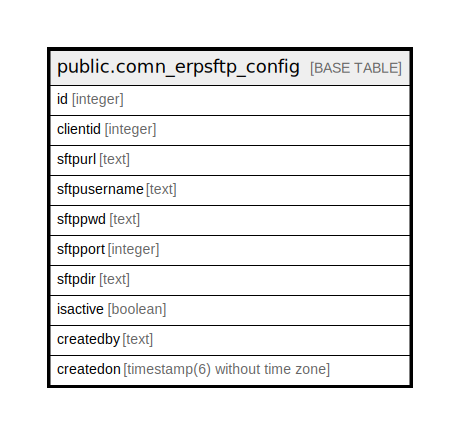

# public.comn_erpsftp_config

## Description

## Columns

| Name | Type | Default | Nullable | Children | Parents | Comment |
| ---- | ---- | ------- | -------- | -------- | ------- | ------- |
| id | integer | nextval('comn_erpsftp_config_id_seq'::regclass) | false |  |  |  |
| clientid | integer |  | false |  |  |  |
| sftpurl | text |  | false |  |  |  |
| sftpusername | text |  | false |  |  |  |
| sftppwd | text |  | false |  |  |  |
| sftpport | integer |  | false |  |  |  |
| sftpdir | text |  | true |  |  |  |
| isactive | boolean | true | false |  |  |  |
| createdby | text |  | true |  |  |  |
| createdon | timestamp(6) without time zone | now() | true |  |  |  |

## Constraints

| Name | Type | Definition |
| ---- | ---- | ---------- |
| comn_erpsftp_config_pkey | PRIMARY KEY | PRIMARY KEY (id) |
| comn_erpsftp_config_ukey | UNIQUE | UNIQUE (clientid, isactive) |

## Indexes

| Name | Definition |
| ---- | ---------- |
| comn_erpsftp_config_pkey | CREATE UNIQUE INDEX comn_erpsftp_config_pkey ON public.comn_erpsftp_config USING btree (id) |
| comn_erpsftp_config_ukey | CREATE UNIQUE INDEX comn_erpsftp_config_ukey ON public.comn_erpsftp_config USING btree (clientid, isactive) |

## Relations

---

> Generated by [tbls](https://github.com/k1LoW/tbls)
