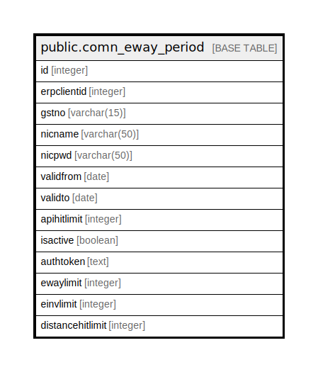

# public.comn_eway_period

## Description

## Columns

| Name | Type | Default | Nullable | Children | Parents | Comment |
| ---- | ---- | ------- | -------- | -------- | ------- | ------- |
| id | integer |  | false |  |  |  |
| erpclientid | integer |  | false |  |  |  |
| gstno | varchar(15) |  | false |  |  |  |
| nicname | varchar(50) |  | true |  |  |  |
| nicpwd | varchar(50) |  | true |  |  |  |
| validfrom | date |  | false |  |  |  |
| validto | date |  | false |  |  |  |
| apihitlimit | integer |  | false |  |  |  |
| isactive | boolean |  | false |  |  |  |
| authtoken | text |  | true |  |  |  |
| ewaylimit | integer | 0 | false |  |  |  |
| einvlimit | integer | 0 | false |  |  |  |
| distancehitlimit | integer | 0 | true |  |  |  |

## Constraints

| Name | Type | Definition |
| ---- | ---- | ---------- |
| comn_eway_period_id_key | UNIQUE | UNIQUE (id) |

## Indexes

| Name | Definition |
| ---- | ---------- |
| comn_eway_period_id_key | CREATE UNIQUE INDEX comn_eway_period_id_key ON public.comn_eway_period USING btree (id) |

## Relations

---

> Generated by [tbls](https://github.com/k1LoW/tbls)
