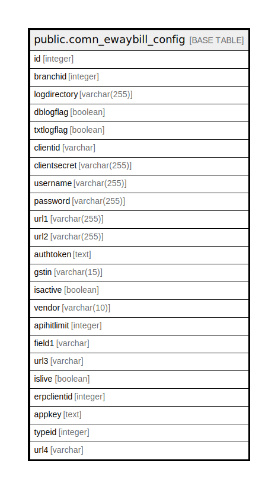

# public.comn_ewaybill_config

## Description

## Columns

| Name | Type | Default | Nullable | Children | Parents | Comment |
| ---- | ---- | ------- | -------- | -------- | ------- | ------- |
| id | integer |  | false |  |  |  |
| branchid | integer |  | true |  |  |  |
| logdirectory | varchar(255) |  | true |  |  |  |
| dblogflag | boolean | false | true |  |  |  |
| txtlogflag | boolean | false | true |  |  |  |
| clientid | varchar |  | true |  |  |  |
| clientsecret | varchar(255) |  | true |  |  |  |
| username | varchar(255) |  | true |  |  |  |
| password | varchar(255) |  | true |  |  |  |
| url1 | varchar(255) |  | true |  |  | This URL for get token of authorize |
| url2 | varchar(255) |  | true |  |  | This URL for put/save the detailes |
| authtoken | text |  | true |  |  |  |
| gstin | varchar(15) |  | true |  |  |  |
| isactive | boolean | false | false |  |  |  |
| vendor | varchar(10) |  | true |  |  |  |
| apihitlimit | integer | 0 | false |  |  |  |
| field1 | varchar |  | true |  |  |  |
| url3 | varchar |  | true |  |  | This URL for Get the detailes based on action type |
| islive | boolean | true | false |  |  |  |
| erpclientid | integer | 0 | false |  |  |  |
| appkey | text |  | true |  |  |  |
| typeid | integer | 0 | false |  |  |  |
| url4 | varchar |  | true |  |  |  |

## Constraints

| Name | Type | Definition |
| ---- | ---- | ---------- |
| comn_ewaybill_config_pkey | PRIMARY KEY | PRIMARY KEY (id) |

## Indexes

| Name | Definition |
| ---- | ---------- |
| comn_ewaybill_config_pkey | CREATE UNIQUE INDEX comn_ewaybill_config_pkey ON public.comn_ewaybill_config USING btree (id) |

## Relations

---

> Generated by [tbls](https://github.com/k1LoW/tbls)
