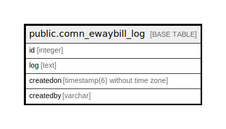

# public.comn_ewaybill_log

## Description

## Columns

| Name | Type | Default | Nullable | Children | Parents | Comment |
| ---- | ---- | ------- | -------- | -------- | ------- | ------- |
| id | integer | nextval('comn_ewaybill_log_id'::regclass) | false |  |  |  |
| log | text |  | true |  |  |  |
| createdon | timestamp(6) without time zone | now() | true |  |  |  |
| createdby | varchar |  | true |  |  |  |

## Constraints

| Name | Type | Definition |
| ---- | ---- | ---------- |
| comn_ewaybill_log_pkey | PRIMARY KEY | PRIMARY KEY (id) |

## Indexes

| Name | Definition |
| ---- | ---------- |
| comn_ewaybill_log_pkey | CREATE UNIQUE INDEX comn_ewaybill_log_pkey ON public.comn_ewaybill_log USING btree (id) |

## Relations

---

> Generated by [tbls](https://github.com/k1LoW/tbls)
