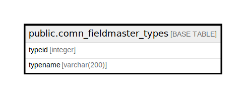

# public.comn_fieldmaster_types

## Description

## Columns

| Name | Type | Default | Nullable | Children | Parents | Comment |
| ---- | ---- | ------- | -------- | -------- | ------- | ------- |
| typeid | integer | nextval('comn_fieldmaster_types_typeid_seq'::regclass) | false |  |  |  |
| typename | varchar(200) | NULL::character varying | true |  |  |  |

## Constraints

| Name | Type | Definition |
| ---- | ---- | ---------- |
| comn_fieldmaster_types_pkey | PRIMARY KEY | PRIMARY KEY (typeid) |

## Indexes

| Name | Definition |
| ---- | ---------- |
| comn_fieldmaster_types_pkey | CREATE UNIQUE INDEX comn_fieldmaster_types_pkey ON public.comn_fieldmaster_types USING btree (typeid) |

## Relations

---

> Generated by [tbls](https://github.com/k1LoW/tbls)
