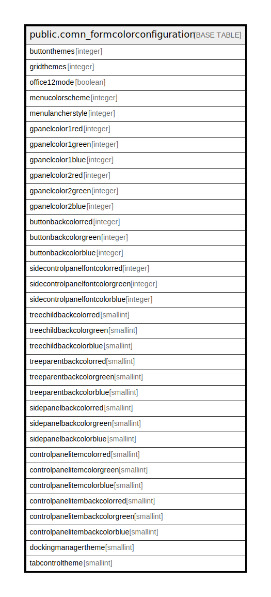

# public.comn_formcolorconfiguration

## Description

## Columns

| Name | Type | Default | Nullable | Children | Parents | Comment |
| ---- | ---- | ------- | -------- | -------- | ------- | ------- |
| buttonthemes | integer |  | true |  |  |  |
| gridthemes | integer |  | true |  |  |  |
| office12mode | boolean |  | true |  |  |  |
| menucolorscheme | integer |  | true |  |  |  |
| menulancherstyle | integer |  | true |  |  |  |
| gpanelcolor1red | integer |  | true |  |  |  |
| gpanelcolor1green | integer |  | true |  |  |  |
| gpanelcolor1blue | integer |  | true |  |  |  |
| gpanelcolor2red | integer |  | true |  |  |  |
| gpanelcolor2green | integer |  | true |  |  |  |
| gpanelcolor2blue | integer |  | true |  |  |  |
| buttonbackcolorred | integer |  | true |  |  |  |
| buttonbackcolorgreen | integer |  | true |  |  |  |
| buttonbackcolorblue | integer |  | true |  |  |  |
| sidecontrolpanelfontcolorred | integer |  | true |  |  |  |
| sidecontrolpanelfontcolorgreen | integer |  | true |  |  |  |
| sidecontrolpanelfontcolorblue | integer |  | true |  |  |  |
| treechildbackcolorred | smallint |  | true |  |  |  |
| treechildbackcolorgreen | smallint |  | true |  |  |  |
| treechildbackcolorblue | smallint |  | true |  |  |  |
| treeparentbackcolorred | smallint |  | true |  |  |  |
| treeparentbackcolorgreen | smallint |  | true |  |  |  |
| treeparentbackcolorblue | smallint |  | true |  |  |  |
| sidepanelbackcolorred | smallint |  | true |  |  |  |
| sidepanelbackcolorgreen | smallint |  | true |  |  |  |
| sidepanelbackcolorblue | smallint |  | true |  |  |  |
| controlpanelitemcolorred | smallint |  | true |  |  |  |
| controlpanelitemcolorgreen | smallint |  | true |  |  |  |
| controlpanelitemcolorblue | smallint |  | true |  |  |  |
| controlpanelitembackcolorred | smallint |  | true |  |  |  |
| controlpanelitembackcolorgreen | smallint |  | true |  |  |  |
| controlpanelitembackcolorblue | smallint |  | true |  |  |  |
| dockingmanagertheme | smallint |  | true |  |  |  |
| tabcontroltheme | smallint |  | true |  |  |  |

## Relations

---

> Generated by [tbls](https://github.com/k1LoW/tbls)
