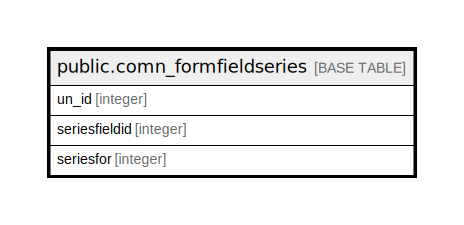

# public.comn_formfieldseries

## Description

## Columns

| Name | Type | Default | Nullable | Children | Parents | Comment |
| ---- | ---- | ------- | -------- | -------- | ------- | ------- |
| un_id | integer | nextval('comn_formfieldseries_un_id_seq'::regclass) | false |  |  |  |
| seriesfieldid | integer |  | false |  |  |  |
| seriesfor | integer | 0 | false |  |  | 0=others,1=item,2=party,3=item batch/serial |

## Constraints

| Name | Type | Definition |
| ---- | ---- | ---------- |
| UniqueFieldIdAndFieldFor | UNIQUE | UNIQUE (seriesfieldid, seriesfor) |
| comn_formfieldseries_pkey | PRIMARY KEY | PRIMARY KEY (un_id) |

## Indexes

| Name | Definition |
| ---- | ---------- |
| UniqueFieldIdAndFieldFor | CREATE UNIQUE INDEX "UniqueFieldIdAndFieldFor" ON public.comn_formfieldseries USING btree (seriesfieldid, seriesfor) |
| comn_formfieldseries_pkey | CREATE UNIQUE INDEX comn_formfieldseries_pkey ON public.comn_formfieldseries USING btree (un_id) |

## Relations

---

> Generated by [tbls](https://github.com/k1LoW/tbls)
