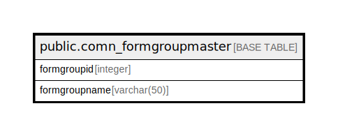

# public.comn_formgroupmaster

## Description

## Columns

| Name | Type | Default | Nullable | Children | Parents | Comment |
| ---- | ---- | ------- | -------- | -------- | ------- | ------- |
| formgroupid | integer |  | false |  |  |  |
| formgroupname | varchar(50) |  | true |  |  |  |

## Constraints

| Name | Type | Definition |
| ---- | ---- | ---------- |
| comn_formgroupmaster_pkey | PRIMARY KEY | PRIMARY KEY (formgroupid) |

## Indexes

| Name | Definition |
| ---- | ---------- |
| comn_formgroupmaster_pkey | CREATE UNIQUE INDEX comn_formgroupmaster_pkey ON public.comn_formgroupmaster USING btree (formgroupid) |

## Relations

---

> Generated by [tbls](https://github.com/k1LoW/tbls)
