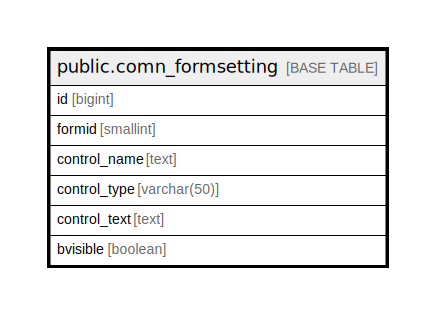

# public.comn_formsetting

## Description

## Columns

| Name | Type | Default | Nullable | Children | Parents | Comment |
| ---- | ---- | ------- | -------- | -------- | ------- | ------- |
| id | bigint | nextval('comn_formsetting_id_seq'::regclass) | false |  |  |  |
| formid | smallint |  | false |  |  |  |
| control_name | text |  | false |  |  |  |
| control_type | varchar(50) |  | false |  |  |  |
| control_text | text |  | true |  |  |  |
| bvisible | boolean | true | false |  |  |  |

## Constraints

| Name | Type | Definition |
| ---- | ---- | ---------- |
| comn_formsetting_pkey | PRIMARY KEY | PRIMARY KEY (id) |

## Indexes

| Name | Definition |
| ---- | ---------- |
| comn_formsetting_pkey | CREATE UNIQUE INDEX comn_formsetting_pkey ON public.comn_formsetting USING btree (id) |

## Relations

---

> Generated by [tbls](https://github.com/k1LoW/tbls)
