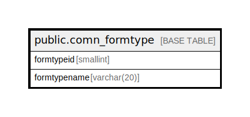

# public.comn_formtype

## Description

## Columns

| Name | Type | Default | Nullable | Children | Parents | Comment |
| ---- | ---- | ------- | -------- | -------- | ------- | ------- |
| formtypeid | smallint |  | false |  |  |  |
| formtypename | varchar(20) |  | true |  |  |  |

## Constraints

| Name | Type | Definition |
| ---- | ---- | ---------- |
| formtype_pkey | PRIMARY KEY | PRIMARY KEY (formtypeid) |

## Indexes

| Name | Definition |
| ---- | ---------- |
| formtype_pkey | CREATE UNIQUE INDEX formtype_pkey ON public.comn_formtype USING btree (formtypeid) |

## Relations

---

> Generated by [tbls](https://github.com/k1LoW/tbls)
