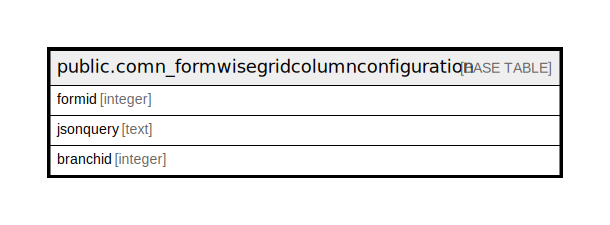

# public.comn_formwisegridcolumnconfiguration

## Description

## Columns

| Name | Type | Default | Nullable | Children | Parents | Comment |
| ---- | ---- | ------- | -------- | -------- | ------- | ------- |
| formid | integer |  | false |  |  |  |
| jsonquery | text |  | true |  |  |  |
| branchid | integer |  | false |  |  |  |

## Constraints

| Name | Type | Definition |
| ---- | ---- | ---------- |
| comn_formwisegridcolumnconfiguration_pkey | PRIMARY KEY | PRIMARY KEY (formid, branchid) |

## Indexes

| Name | Definition |
| ---- | ---------- |
| comn_formwisegridcolumnconfiguration_pkey | CREATE UNIQUE INDEX comn_formwisegridcolumnconfiguration_pkey ON public.comn_formwisegridcolumnconfiguration USING btree (formid, branchid) |

## Relations

---

> Generated by [tbls](https://github.com/k1LoW/tbls)
