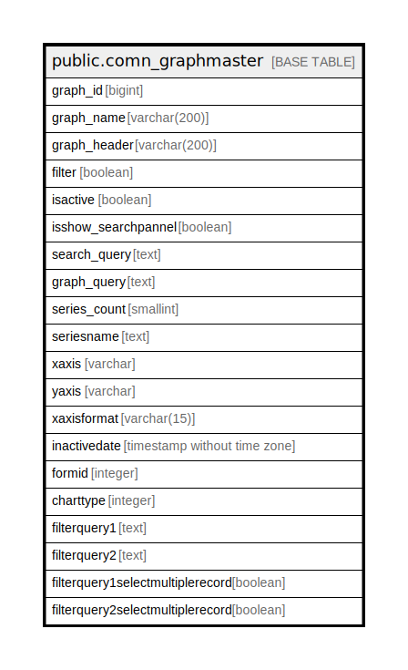

# public.comn_graphmaster

## Description

## Columns

| Name | Type | Default | Nullable | Children | Parents | Comment |
| ---- | ---- | ------- | -------- | -------- | ------- | ------- |
| graph_id | bigint | nextval('comn_graphmaster_graph_id_seq'::regclass) | false |  |  |  |
| graph_name | varchar(200) |  | false |  |  |  |
| graph_header | varchar(200) |  | false |  |  |  |
| filter | boolean | false | false |  |  |  |
| isactive | boolean | true | false |  |  |  |
| isshow_searchpannel | boolean | false | false |  |  |  |
| search_query | text |  | true |  |  |  |
| graph_query | text |  | true |  |  |  |
| series_count | smallint | 1 | false |  |  |  |
| seriesname | text |  | true |  |  |  |
| xaxis | varchar |  | true |  |  |  |
| yaxis | varchar |  | true |  |  |  |
| xaxisformat | varchar(15) |  | true |  |  |  |
| inactivedate | timestamp without time zone |  | true |  |  |  |
| formid | integer |  | true |  |  |  |
| charttype | integer |  | true |  |  | 0 = Line 1 = Spline 2 = Roated SP Line 3 = Scatter 4 = Column 5 = Bar 6 = Gannt 7 = Staking Bar 8 = Ares 9 = Range Area 10 = SplineArea 11 = Staking Area 12 = Staking Column 13 = Staking Area 100 14 = Staking Bar 100 15 = Staking Column 100 16 = PieChart 17 = Funnel 19 = Hilo 20 = Hilo Open Close 21 = Candle 22 = Bubble 23 = Step Line 24 = Step Area 25 = Radar 26 = Kagi 27 = Ranko 29 = Column Range 31 = Point and Figure 32 = Box and Whisker 33 = Histogram 24 = Tornado 28 = Polar 30 = Three Link Break 35 = Heat MAP 36 = Custom  |
| filterquery1 | text |  | true |  |  |  |
| filterquery2 | text |  | true |  |  |  |
| filterquery1selectmultiplerecord | boolean | false | true |  |  |  |
| filterquery2selectmultiplerecord | boolean | false | true |  |  |  |

## Constraints

| Name | Type | Definition |
| ---- | ---- | ---------- |
| comn_graphmaster_pkey | PRIMARY KEY | PRIMARY KEY (graph_id) |

## Indexes

| Name | Definition |
| ---- | ---------- |
| comn_graphmaster_pkey | CREATE UNIQUE INDEX comn_graphmaster_pkey ON public.comn_graphmaster USING btree (graph_id) |

## Relations

---

> Generated by [tbls](https://github.com/k1LoW/tbls)
