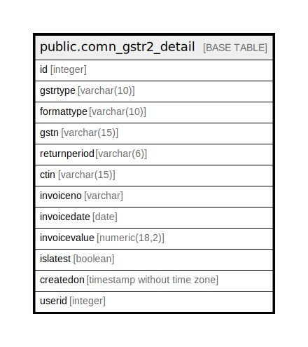

# public.comn_gstr2_detail

## Description

## Columns

| Name | Type | Default | Nullable | Children | Parents | Comment |
| ---- | ---- | ------- | -------- | -------- | ------- | ------- |
| id | integer | nextval('comn_gstr2_detail_id'::regclass) | false |  |  |  |
| gstrtype | varchar(10) |  | true |  |  |  |
| formattype | varchar(10) |  | true |  |  |  |
| gstn | varchar(15) |  | false |  |  |  |
| returnperiod | varchar(6) |  | false |  |  |  |
| ctin | varchar(15) |  | true |  |  |  |
| invoiceno | varchar |  | true |  |  |  |
| invoicedate | date |  | true |  |  |  |
| invoicevalue | numeric(18,2) |  | true |  |  |  |
| islatest | boolean | true | false |  |  |  |
| createdon | timestamp without time zone | now() | true |  |  |  |
| userid | integer |  | true |  |  |  |

## Relations

---

> Generated by [tbls](https://github.com/k1LoW/tbls)
