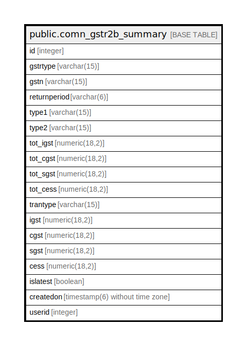

# public.comn_gstr2b_summary

## Description

## Columns

| Name | Type | Default | Nullable | Children | Parents | Comment |
| ---- | ---- | ------- | -------- | -------- | ------- | ------- |
| id | integer | nextval('comn_gstr2b_summary_id_seq'::regclass) | false |  |  |  |
| gstrtype | varchar(15) |  | false |  |  |  |
| gstn | varchar(15) |  | false |  |  |  |
| returnperiod | varchar(6) |  | false |  |  |  |
| type1 | varchar(15) |  | true |  |  |  |
| type2 | varchar(15) |  | true |  |  |  |
| tot_igst | numeric(18,2) |  | true |  |  |  |
| tot_cgst | numeric(18,2) |  | true |  |  |  |
| tot_sgst | numeric(18,2) |  | true |  |  |  |
| tot_cess | numeric(18,2) |  | true |  |  |  |
| trantype | varchar(15) |  | true |  |  |  |
| igst | numeric(18,2) |  | true |  |  |  |
| cgst | numeric(18,2) |  | true |  |  |  |
| sgst | numeric(18,2) |  | true |  |  |  |
| cess | numeric(18,2) |  | true |  |  |  |
| islatest | boolean | true | false |  |  |  |
| createdon | timestamp(6) without time zone | now() | true |  |  |  |
| userid | integer |  | true |  |  |  |

## Constraints

| Name | Type | Definition |
| ---- | ---- | ---------- |
| comn_gstr2b_summary_pkey | PRIMARY KEY | PRIMARY KEY (id) |

## Indexes

| Name | Definition |
| ---- | ---------- |
| comn_gstr2b_summary_pkey | CREATE UNIQUE INDEX comn_gstr2b_summary_pkey ON public.comn_gstr2b_summary USING btree (id) |

## Relations

---

> Generated by [tbls](https://github.com/k1LoW/tbls)
