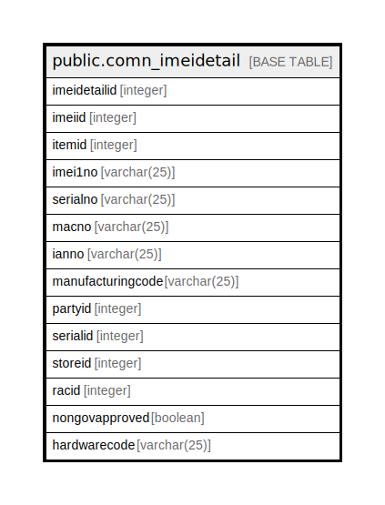

# public.comn_imeidetail

## Description

## Columns

| Name | Type | Default | Nullable | Children | Parents | Comment |
| ---- | ---- | ------- | -------- | -------- | ------- | ------- |
| imeidetailid | integer | nextval('comn_imeidetail_imeidetailid_seq'::regclass) | false |  |  |  |
| imeiid | integer |  | true |  |  |  |
| itemid | integer |  | true |  |  |  |
| imei1no | varchar(25) |  | true |  |  |  |
| serialno | varchar(25) |  | true |  |  |  |
| macno | varchar(25) |  | true |  |  |  |
| ianno | varchar(25) |  | true |  |  |  |
| manufacturingcode | varchar(25) |  | true |  |  |  |
| partyid | integer |  | true |  |  |  |
| serialid | integer |  | true |  |  |  |
| storeid | integer |  | true |  |  |  |
| racid | integer |  | true |  |  |  |
| nongovapproved | boolean | false | true |  |  |  |
| hardwarecode | varchar(25) | ''::character varying | false |  |  |  |

## Constraints

| Name | Type | Definition |
| ---- | ---- | ---------- |
| comn_imeidetail_pkey | PRIMARY KEY | PRIMARY KEY (imeidetailid) |

## Indexes

| Name | Definition |
| ---- | ---------- |
| comn_imeidetail_pkey | CREATE UNIQUE INDEX comn_imeidetail_pkey ON public.comn_imeidetail USING btree (imeidetailid) |

## Relations

---

> Generated by [tbls](https://github.com/k1LoW/tbls)
