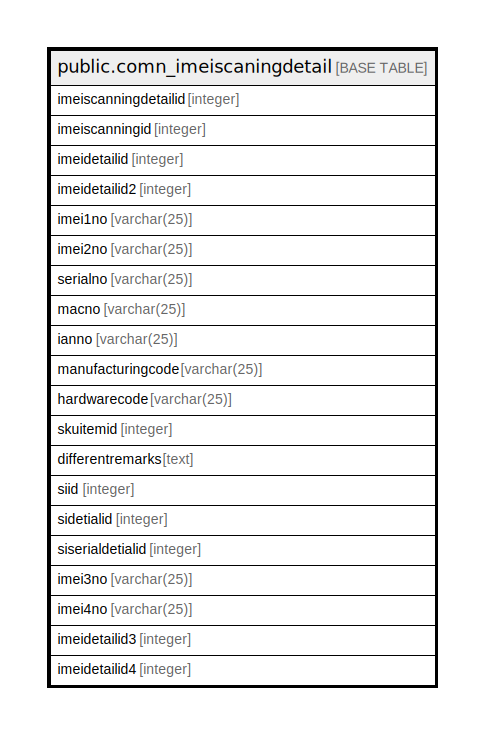

# public.comn_imeiscaningdetail

## Description

IMEI Scanning entry detail after Gate Entry and before Inward challan

## Columns

| Name | Type | Default | Nullable | Children | Parents | Comment |
| ---- | ---- | ------- | -------- | -------- | ------- | ------- |
| imeiscanningdetailid | integer | nextval('comn_imeiscaningdetail_imeiscanningdetailid_seq'::regclass) | false |  |  |  |
| imeiscanningid | integer |  | true |  |  |  |
| imeidetailid | integer |  | true |  |  |  |
| imeidetailid2 | integer |  | true |  |  |  |
| imei1no | varchar(25) |  | true |  |  |  |
| imei2no | varchar(25) |  | true |  |  |  |
| serialno | varchar(25) |  | true |  |  |  |
| macno | varchar(25) |  | true |  |  |  |
| ianno | varchar(25) |  | true |  |  |  |
| manufacturingcode | varchar(25) |  | true |  |  |  |
| hardwarecode | varchar(25) | ''::character varying | false |  |  |  |
| skuitemid | integer | 0 | false |  |  |  |
| differentremarks | text | ''::text | false |  |  |  |
| siid | integer | 0 | true |  |  |  |
| sidetialid | integer | 0 | true |  |  |  |
| siserialdetialid | integer | 0 | true |  |  |  |
| imei3no | varchar(25) |  | true |  |  |  |
| imei4no | varchar(25) |  | true |  |  |  |
| imeidetailid3 | integer |  | true |  |  |  |
| imeidetailid4 | integer |  | true |  |  |  |

## Constraints

| Name | Type | Definition |
| ---- | ---- | ---------- |
| comn_imeiscaningdetail_pkey | PRIMARY KEY | PRIMARY KEY (imeiscanningdetailid) |

## Indexes

| Name | Definition |
| ---- | ---------- |
| comn_imeiscaningdetail_pkey | CREATE UNIQUE INDEX comn_imeiscaningdetail_pkey ON public.comn_imeiscaningdetail USING btree (imeiscanningdetailid) |

## Triggers

| Name | Definition |
| ---- | ---------- |
| imeiscanningdetailid | CREATE TRIGGER imeiscanningdetailid AFTER INSERT OR UPDATE ON public.comn_imeiscaningdetail FOR EACH ROW EXECUTE FUNCTION tgr_cartonstatusingateentryimeidetail() |

## Relations

---

> Generated by [tbls](https://github.com/k1LoW/tbls)
