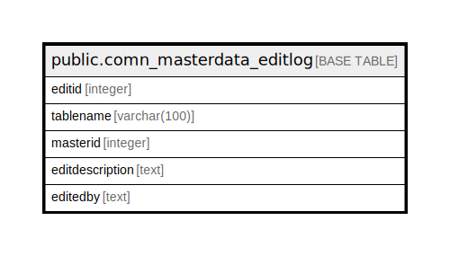

# public.comn_masterdata_editlog

## Description

## Columns

| Name | Type | Default | Nullable | Children | Parents | Comment |
| ---- | ---- | ------- | -------- | -------- | ------- | ------- |
| editid | integer | nextval('comn_masterdata_editlog_editid_seq'::regclass) | false |  |  |  |
| tablename | varchar(100) |  | true |  |  |  |
| masterid | integer |  | true |  |  |  |
| editdescription | text |  | true |  |  |  |
| editedby | text |  | true |  |  |  |

## Constraints

| Name | Type | Definition |
| ---- | ---- | ---------- |
| comn_masterdata_editlog_pkey | PRIMARY KEY | PRIMARY KEY (editid) |

## Indexes

| Name | Definition |
| ---- | ---------- |
| comn_masterdata_editlog_pkey | CREATE UNIQUE INDEX comn_masterdata_editlog_pkey ON public.comn_masterdata_editlog USING btree (editid) |

## Relations

---

> Generated by [tbls](https://github.com/k1LoW/tbls)
