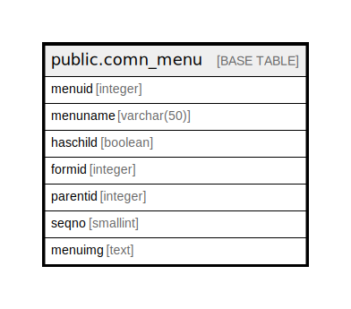

# public.comn_menu

## Description

## Columns

| Name | Type | Default | Nullable | Children | Parents | Comment |
| ---- | ---- | ------- | -------- | -------- | ------- | ------- |
| menuid | integer |  | false |  |  |  |
| menuname | varchar(50) |  | true |  |  |  |
| haschild | boolean | false | true |  |  |  |
| formid | integer |  | true |  |  |  |
| parentid | integer | 0 | true |  |  |  |
| seqno | smallint | 1 | true |  |  |  |
| menuimg | text |  | true |  |  |  |

## Constraints

| Name | Type | Definition |
| ---- | ---- | ---------- |
| comn_menu_pkey | PRIMARY KEY | PRIMARY KEY (menuid) |

## Indexes

| Name | Definition |
| ---- | ---------- |
| comn_menu_pkey | CREATE UNIQUE INDEX comn_menu_pkey ON public.comn_menu USING btree (menuid) |

## Relations

---

> Generated by [tbls](https://github.com/k1LoW/tbls)
