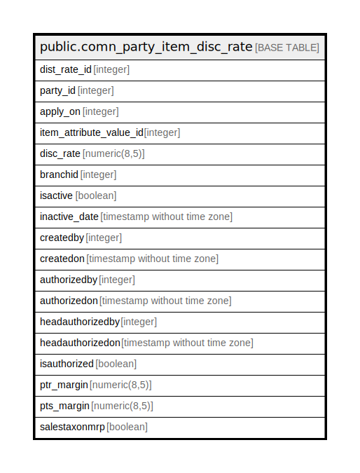

# public.comn_party_item_disc_rate

## Description

## Columns

| Name | Type | Default | Nullable | Children | Parents | Comment |
| ---- | ---- | ------- | -------- | -------- | ------- | ------- |
| dist_rate_id | integer | nextval('comn_party_item_disc_rate_dist_rate_id_seq'::regclass) | false |  |  |  |
| party_id | integer |  | true |  |  |  |
| apply_on | integer |  | true |  |  | 1=Party 2=Group |
| item_attribute_value_id | integer |  | true |  |  |  |
| disc_rate | numeric(8,5) | 0 | true |  |  | Discount Rate (%) |
| branchid | integer |  | true |  |  |  |
| isactive | boolean | false | true |  |  |  |
| inactive_date | timestamp without time zone |  | true |  |  |  |
| createdby | integer |  | true |  |  |  |
| createdon | timestamp without time zone | now() | true |  |  |  |
| authorizedby | integer |  | true |  |  |  |
| authorizedon | timestamp without time zone |  | true |  |  |  |
| headauthorizedby | integer |  | true |  |  |  |
| headauthorizedon | timestamp without time zone |  | true |  |  |  |
| isauthorized | boolean |  | true |  |  |  |
| ptr_margin | numeric(8,5) |  | true |  |  |  |
| pts_margin | numeric(8,5) |  | true |  |  |  |
| salestaxonmrp | boolean | false | true |  |  |  |

## Constraints

| Name | Type | Definition |
| ---- | ---- | ---------- |
| comn_party_item_disc_rate_pkey | PRIMARY KEY | PRIMARY KEY (dist_rate_id) |
| party_inactive | UNIQUE | UNIQUE (party_id, apply_on, item_attribute_value_id, inactive_date, branchid) |

## Indexes

| Name | Definition |
| ---- | ---------- |
| comn_party_item_disc_rate_pkey | CREATE UNIQUE INDEX comn_party_item_disc_rate_pkey ON public.comn_party_item_disc_rate USING btree (dist_rate_id) |
| party_inactive | CREATE UNIQUE INDEX party_inactive ON public.comn_party_item_disc_rate USING btree (party_id, apply_on, item_attribute_value_id, inactive_date, branchid) |

## Relations

---

> Generated by [tbls](https://github.com/k1LoW/tbls)
