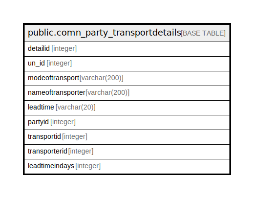

# public.comn_party_transportdetails

## Description

## Columns

| Name | Type | Default | Nullable | Children | Parents | Comment |
| ---- | ---- | ------- | -------- | -------- | ------- | ------- |
| detailid | integer | nextval('comn_party_transportdetails_detailid_seq'::regclass) | false |  |  |  |
| un_id | integer |  | true |  |  |  |
| modeoftransport | varchar(200) | NULL::character varying | true |  |  |  |
| nameoftransporter | varchar(200) | NULL::character varying | true |  |  |  |
| leadtime | varchar(20) | NULL::character varying | true |  |  |  |
| partyid | integer |  | true |  |  |  |
| transportid | integer |  | true |  |  |  |
| transporterid | integer |  | true |  |  |  |
| leadtimeindays | integer |  | true |  |  |  |

## Relations

---

> Generated by [tbls](https://github.com/k1LoW/tbls)
