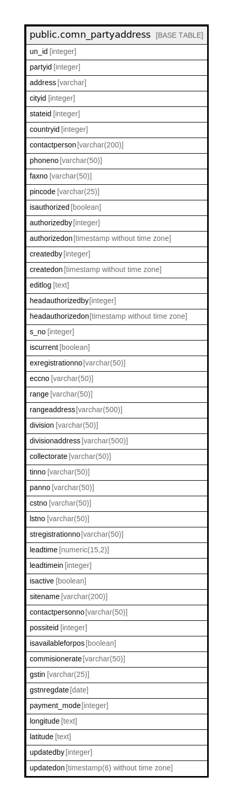

# public.comn_partyaddress

## Description

## Columns

| Name | Type | Default | Nullable | Children | Parents | Comment |
| ---- | ---- | ------- | -------- | -------- | ------- | ------- |
| un_id | integer | nextval('comn_partyaddress_un_id_seq'::regclass) | false |  |  |  |
| partyid | integer |  | false |  |  |  |
| address | varchar |  | true |  |  |  |
| cityid | integer |  | true |  |  |  |
| stateid | integer |  | true |  |  |  |
| countryid | integer |  | true |  |  |  |
| contactperson | varchar(200) |  | true |  |  |  |
| phoneno | varchar(50) |  | true |  |  |  |
| faxno | varchar(50) |  | true |  |  |  |
| pincode | varchar(25) |  | true |  |  |  |
| isauthorized | boolean | false | false |  |  |  |
| authorizedby | integer |  | true |  |  |  |
| authorizedon | timestamp without time zone |  | true |  |  |  |
| createdby | integer |  | true |  |  |  |
| createdon | timestamp without time zone | now() | true |  |  |  |
| editlog | text |  | true |  |  |  |
| headauthorizedby | integer |  | true |  |  |  |
| headauthorizedon | timestamp without time zone |  | true |  |  |  |
| s_no | integer |  | true |  |  |  |
| iscurrent | boolean | false | true |  |  |  |
| exregistrationno | varchar(50) |  | true |  |  |  |
| eccno | varchar(50) |  | true |  |  |  |
| range | varchar(50) |  | true |  |  |  |
| rangeaddress | varchar(500) |  | true |  |  |  |
| division | varchar(50) |  | true |  |  |  |
| divisionaddress | varchar(500) |  | true |  |  |  |
| collectorate | varchar(50) |  | true |  |  |  |
| tinno | varchar(50) |  | true |  |  |  |
| panno | varchar(50) |  | true |  |  |  |
| cstno | varchar(50) |  | true |  |  |  |
| lstno | varchar(50) |  | true |  |  |  |
| stregistrationno | varchar(50) |  | true |  |  |  |
| leadtime | numeric(15,2) |  | true |  |  |  |
| leadtimein | integer |  | true |  |  |  |
| isactive | boolean | true | true |  |  |  |
| sitename | varchar(200) |  | true |  |  |  |
| contactpersonno | varchar(50) |  | true |  |  |  |
| possiteid | integer |  | true |  |  |  |
| isavailableforpos | boolean | false | true |  |  |  |
| commisionerate | varchar(50) |  | true |  |  |  |
| gstin | varchar(25) |  | true |  |  |  |
| gstnregdate | date |  | true |  |  |  |
| payment_mode | integer |  | true |  |  |  |
| longitude | text |  | true |  |  |  |
| latitude | text |  | true |  |  |  |
| updatedby | integer |  | true |  |  |  |
| updatedon | timestamp(6) without time zone | NULL::timestamp without time zone | true |  |  |  |

## Constraints

| Name | Type | Definition |
| ---- | ---- | ---------- |
| comn_partyaddress_pkey | PRIMARY KEY | PRIMARY KEY (un_id) |

## Indexes

| Name | Definition |
| ---- | ---------- |
| comn_partyaddress_pkey | CREATE UNIQUE INDEX comn_partyaddress_pkey ON public.comn_partyaddress USING btree (un_id) |

## Relations

---

> Generated by [tbls](https://github.com/k1LoW/tbls)
