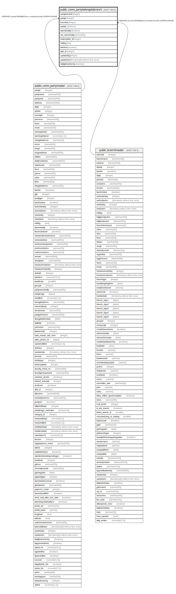

# public.comn_partybelongstobranch

## Description

## Columns

| Name | Type | Default | Nullable | Children | Parents | Comment |
| ---- | ---- | ------- | -------- | -------- | ------- | ------- |
| partybranchid | integer | nextval('comn_partybelongstobranch_partybranchid_seq'::regclass) | false |  |  |  |
| partyid | integer |  | true |  | [public.comn_partymaster](public.comn_partymaster.md) |  |
| branchid | integer |  | true |  | [public.branchmaster](public.branchmaster.md) |  |
| isactive | boolean | true | true |  |  |  |
| issendtotally | boolean |  | true |  |  |  |
| old_nameintally | varchar(50) |  | true |  |  |  |
| taxtemplate_id | integer |  | true |  |  |  |
| editlog | text |  | true |  |  |  |
| isdefault | boolean | false | true |  |  |  |
| slab_id | integer |  | true |  |  |  |
| updatedby | integer |  | true |  |  |  |
| updatedon | timestamp(6) without time zone | NULL::timestamp without time zone | true |  |  |  |
| istallybranchentry | boolean | false | true |  |  |  |

## Constraints

| Name | Type | Definition |
| ---- | ---- | ---------- |
| partybelongstobranch_fk1 | FOREIGN KEY | FOREIGN KEY (branchid) REFERENCES branchmaster(branchid) ON UPDATE CASCADE |
| partybelongstobranch_pkey | PRIMARY KEY | PRIMARY KEY (partybranchid) |
| partybelongstobranch_fk | FOREIGN KEY | FOREIGN KEY (partyid) REFERENCES comn_partymaster(partyid) ON UPDATE CASCADE |
| unique | UNIQUE | UNIQUE (partyid, branchid) |

## Indexes

| Name | Definition |
| ---- | ---------- |
| partybelongstobranch_pkey | CREATE UNIQUE INDEX partybelongstobranch_pkey ON public.comn_partybelongstobranch USING btree (partybranchid) |
| unique | CREATE UNIQUE INDEX "unique" ON public.comn_partybelongstobranch USING btree (partyid, branchid) |
| Index_PartyBranch_BranchIDPartID | CREATE INDEX "Index_PartyBranch_BranchIDPartID" ON public.comn_partybelongstobranch USING btree (branchid, partyid) |
| Index_PartyBranch_PartyID | CREATE INDEX "Index_PartyBranch_PartyID" ON public.comn_partybelongstobranch USING btree (partyid) |

## Triggers

| Name | Definition |
| ---- | ---------- |
| partybelongstobranch_editlog | CREATE TRIGGER partybelongstobranch_editlog AFTER UPDATE ON public.comn_partybelongstobranch FOR EACH ROW EXECUTE FUNCTION partybelongstobranch_editlog() |

## Relations

---

> Generated by [tbls](https://github.com/k1LoW/tbls)
